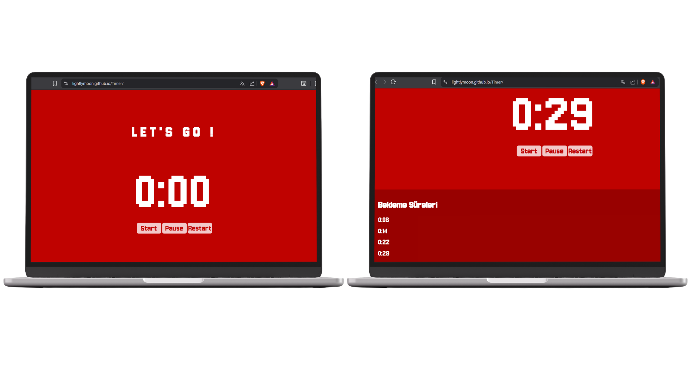

# ⏱️ Timer

### A Clean, Performant and Fully Responsive Web Timer Application

 

 

### 🌐 Live Demo  
👉 **[Click here to see the live demo](https://lightlymoon.github.io/Timer/)**

---
# 📱 User Interface Preview

## Desktop Views 

---

## Mobile Views

  

# ✨ Overview

**Timer** is a lightweight, high-performance web-based timing application designed with simplicity and precision in mind.

Built entirely using **Vanilla JavaScript**, this project demonstrates strong understanding of:

- Time-based logic handling  
- State management  
- DOM control  
- Performance-safe interval management  
- Clean and scalable front-end architecture  

The goal was not just to create a timer — but to build a well-structured, production-ready micro application.

---

# 🎯 Core Features

## ▶ Intelligent Start System
- Initiates timer safely
- Prevents multiple interval stacking
- Maintains internal state integrity

## ⏸ Seamless Pause & Resume
- Halts execution without data loss
- Resumes from the exact elapsed state

## 🔄 Safe Reset Mechanism
- Clears active intervals
- Restores initial UI state
- Eliminates memory leak risk

## 📱 Fully Responsive Interface
- Adaptive layout
- Optimized spacing for all screen sizes
- Clean typography & balanced UI composition

---
# 👨‍💻 Author

Developed by **@lightlymoon**

Focused on writing scalable, structured, and maintainable front-end systems with strong architectural clarity.

---

### ⭐ If you value clean architecture, consider starring the repository.

